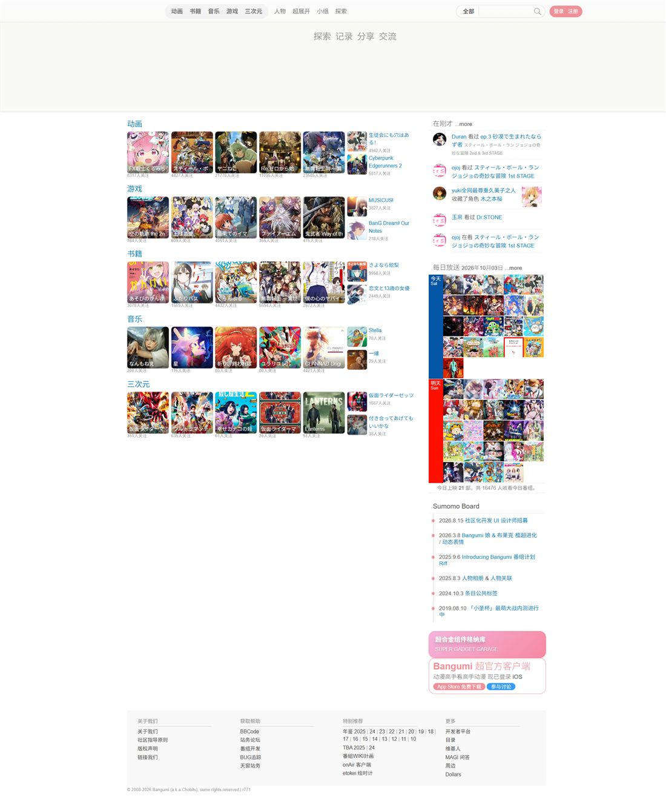

# Bangumi（bgm.tv）交互风格文档

> **分析对象**：https://bgm.tv/（Bangumi 番组计划），站点版本 `r771`
> **样本页面**：首页 `/`、条目页 `/subject/8`、分类索引 `/anime`、个人主页 `/user/sai`、小组 `/group`、目录 `/index`
> **证据来源**：页面原始 HTML（含内联 `onclick`、`onkeydown`）、合并脚本 `/min/g=js?r771`（368,813 字节，站点逻辑集中在 `chiiLib.*` 命名空间与若干 jQuery 插件），以及主样式表中的交互态规则。
> **标注约定**：✅ = 在抓取的 HTML/CSS/JS 中直接可见；🔍 = 由函数名/文案推断（未实际点击验证）。

---

## 1. 交互设计的六条主线

| # | 原则 | 表现 |
| --- | --- | --- |
| 1 | **就地操作，不跳页** | 收藏、评分、进度、回复、删除全部走 AJAX 就地完成（`$.ajax` 出现 178 次） |
| 2 | **hint 极短、反馈即时** | 高频 hover 过渡统一 `transition: all linear .1s`（124 处）；加载即换按钮文案 |
| 3 | **萌系文案承担情绪** | 提交中随机轮播 `嘟嘟噜 / 咪啪 / 大丈夫 / 锵锵 / 叮咚 / 嘎哦 / 呜咕`，失败文案「呜咕，提交出现了一些问题…」 |
| 4 | **hover 优先的桌面交互** | 下拉导航、就地操作条、tooltip 均依赖 `:hover` |
| 5 | **状态先本地、后远端** | 收藏选择、组件暂停状态先写 `localStorage`，再提交服务端 |
| 6 | **个性化常驻入口** | 右下 Dock 常驻「个性化 / 开灯 / 召唤」，随时可换肤、唤出看板娘 |

---

## 2. 全局框架交互

### 2.1 顶部导航（hover 下拉 + 当前栏高亮）✅

```css
#navNeue2 #navMenuNeue li a.chl:hover { background: var(--primary-color,#f09199); color:#fff; }
#navNeue2 #navMenuNeue li:hover a.top { color: var(--primary-color,#f09199); box-shadow:none; }
#navMenuNeue li:hover ul { left:auto; }   /* 二级菜单出场 */
```

- 一级栏目（动画/书籍/音乐/游戏/三次元/人物/超展开/小组/探索）**横向悬停即展开二级菜单**，无需点击；当前栏目用 `.focus.chl.anime` 等类名标记。
- 一级项在 hover 时变成**主色胶囊 + 白字**（`border-radius:100px`），二级项在 hover 时变主色文字。
- 另有 `li.sfhover` 规则，说明历史上用 JS 补丁模拟 hover（IE6 时代遗留）。

### 2.2 搜索栏的折叠（纯 CSS checkbox）✅

```html
<input type="checkbox" id="search-bar-toggle" class="menu-toggle" />
<label for="search-bar-toggle" class="search-menu-compact" role="button" aria-label="搜索"
       onclick="…setTimeout(function(){ document.getElementById('search_text').focus(); }, 300);">
```

```css
#headerSearchWrapper { position:absolute; top:50px; opacity:0; visibility:hidden; transform:translateY(…);
                       transition:all .25s ease-out; pointer-events:none; }
#search-bar-toggle:checked ~ #headerSearchWrapper { z-index:99; opacity:1; visibility:visible; transform:translateY(0);
                       pointer-events:auto; transition:all .25s ease-in; }
```

- 点击放大镜 → 搜索面板**从顶部下滑淡入（250ms）**，并在 300ms 后自动聚焦输入框（等待动画结束再聚焦，避免移动端键盘抖动）。
- 菜单与搜索两个面板**互斥**：`onclick` 中显式取消对方的勾选。

### 2.3 移动端导航

`@media (max-width:640px)` 下（50 处规则）切换为汉堡菜单 + 折叠搜索，同样由 checkbox 驱动，无 JS 依赖。✅

### 2.4 右下角 Dock ✅

```html
<li class="first"><a href="…/login">登录</a><a href="…/signup">注册</a></li>
<li><a class="toggle-customize" title="个性化">…</a></li>
<li class="last"><a id="showrobot" class="toggle-robot">&nbsp;</a></li>
```

- 未登录时展示「登录 / 注册」；「个性化」打开外观面板；第三项是看板娘的召唤/隐藏按钮（隐藏时按钮文案为「召唤」，带 `ico_robot_open` 图标）。✅
- 所有按钮点击后调用 `$(this).blur()` —— **主动取消焦点**，避免 hover/焦点样式残留。✅

整体界面（首页，浅色）——顶部导航、右下 Dock 与页面骨架：



---

## 3. 搜索与联想（`$.fn.suggestBox`）

站点自带联想插件，默认配置如下 ✅：

```js
$.fn.suggestBox = function(c) {
  var options = $.extend({
    mode: "complete",        // 另有 mention（@ 提及）模式
    itemCount: 10,           // 最多 10 条
    customData: null,
    cached: true,            // 结果缓存，避免重复请求
    highlighter: ".highlighter",
    tips: "@ 可以召唤指定用户"
  }, c);
```

行为要点：

- **输入即请求**：按当前分类（`select#siteSearchSelect`：全部/动画/书籍/游戏/音乐/三次元/人物）取候选，命中文本用 `<b>` 包裹高亮。
- **键盘导航**：上下键移动 `li.on` 选中项；`Ctrl/Cmd+A` 与 `Shift+←/→` 被显式放行，避免与选区操作冲突；回车确认后把高亮文本插入输入框并**重设光标位置**，同时清除 `<b>` 标记。✅
- **@ 提及模式**：输入 `@` 唤起用户列表，插入后光标自动落在空格之后（`insertAfterCursor`），提示语为「@ 可以召唤指定用户」。✅
- 仅做一级建议，**没有**搜索历史、热词、纠错等附加层。

---

## 4. 收藏、评分与进度（条目页核心回路）

### 4.1 收藏状态选择（`chiiLib.subject_selection`）✅

- 收藏状态（想看 / 在看 / 看过 / 搁置 / 抛弃）通过下拉/按钮组选择；选择结果先写 `localStorage`：

```js
data_user_selelction_sets[$item.selection_id] = $item; chiiLib.subject_selection.save();
save: function(){ localStorage.setItem(chiiLib.subject_selection.localStorageKey(), JSON.stringify(data_user_selelction_sets)); }
```

- 再次进入条目页时若本地有暂存数据（`chiiLib['selection_mode']='adv'` 高级模式），先读本地恢复，再与服务端同步。
- 提交期间按钮就地替换为加载态；配套文案：`正在加入收藏…`、`正在取消收藏…`、`正在保存…`。✅

### 4.2 进度与章节

- 章节网格中直接点选集数即保存进度，提示「**正在为你保存收视进度**」；进度数字使用等宽字体呈现。✅
- 标签输入：`$("#tags").keyup` 检测空格（`keyCode==32`）触发 `chiiLib.subject.mergeTag()`，把输入串即时转成标签胶囊。✅

### 4.3 评分

- 10 分制，分数与评价词、排名、直方图同屏呈现；直方图柱条在 hover 时给出该分数段的票数。🔍（`votes` 提示文案与 tooltip 容器 `#userStatsContainers` 可见 ✅）

---

## 5. 回复、吐槽与内容编辑

### 5.1 就地回复（`chiiLib.ajax_reply`）✅

模块方法：`mainReply`（主楼回复）、`subReply`（楼中楼）、`insertMainComments` / `insertSubComments` / `insertJsonComments`（插入）、`collapseReplies`（折叠子回复）。

- 回复成功后**直接插入 DOM**，不刷新页面；插入后附带「恭喜恭喜，吐槽成功咯～ 你可以在时光机里看到自己和好友们的吐槽哟。」并给出链接。✅
- 删除走二次确认：`确认删除这条回复?` → `正在删除回复…` → `你选择的回复已经删除咯～`。✅
- 编辑器支持 **Ctrl+Enter 提交**（内联 `onkeydown="seditor_ctlent(event,'ReplysForm')"`），提交按钮文案为「写好了」。✅
- 实时字数统计：「还可以输入 N 字」。✅

### 5.2 剧透折叠 ✅

```js
if ($('.crt_relations li.spoiler').length) {
  $('#toggle_spoiler').html(`显示剧透关系(${…length})`).removeClass('hidden');
  … toggleClass('show_spoiler');
}
```

- 默认隐藏剧透内容，按钮文案在「显示剧透关系(n)」与「隐藏剧透关系(n)」之间切换；列表筛选时若当前处于显示态，会**保持显示态重排**（`applyFilter` 内保存/还原 `show_spoiler`）。

### 5.3 内联小编辑器

首页/条目页可内联展开吐槽框（`<textarea …onkeydown="seditor_ctlent(event,'TsukkomiFrom')">`），并附「看看其他人的吐槽」入口与看板娘关闭按钮（`.ukagaka_robot_dismiss`）。✅

---

## 6. 反馈与提示系统（本站在此最有个性）

### 6.1 统一文案表 `AJAXtip` ✅

```js
var AJAXtip = {
  wait: ' 请稍候...',
  saving: '正在保存...',
  eraseReplyConfirm: '确认删除这条回复?',
  eraseingReply: '正在删除回复...',
  eraseReply: '你选择的回复已经删除咯～',
  addingFrd: '正在添加好友...',
  addingDoujinCollect: '正在加入收藏...',
  rmDoujinCollect: '正在取消收藏...',
  addFrd: '恭喜恭喜，好友添加成功咯～',
  addSay: '恭喜恭喜，吐槽成功咯～<br />你可以在 <a href="/timeline?type=say">时光机</a> 里看到…',
  error: '呜咕，提交出现了一些问题，请稍候再试...',
  no_subject: '呜咕，似乎没有这个条目，请检查URL是否正确或者换一个条目关联...'
};
```

规律：**进行时 = "正在 X…"；成功 = "恭喜恭喜…咯～"；失败 = "呜咕，…"**。语气词固定，便于用户形成预期。

### 6.2 随机语气词 ✅

```js
var waits = ["嘟嘟噜","咪啪","大丈夫","锵锵","叮咚","嘎哦","呜咕"];
$('#submitBtnO').html(' <span class=tip_i>' + wait + '~正在发送请求</span>');
```

提交按钮的加载态**随机换词**，把等待变成轻量的情绪体验；失败则替换为 `<span class="alarm">` 的红色文案。

### 6.3 其他反馈口径 ✅

| 场景 | 文案 |
| --- | --- |
| 字数上限 | 「还可以输入 123 字」 |
| 表单校验 | 「请填写回复内容」「请填写正文内容」「请填写标题」「请填写访问地址」「请确认两次输入相同」「请设置至少 N 位以上的密码」 |
| 登录失败 | 「登录失败」「密码验证失败」「请稍后再试」 |
| 提醒 | 「你有 N 条新提醒」「已经没有新提醒咯」「电波提醒」 |
| 删除确认 | 「确认删除这个主题」「确认删除这篇日志」「确认删除这条短信」「确认删除这个条目收藏」 |
| 未登录看板娘 | 「没注册时我很沉默」 |

---

## 7. 浮层：tooltip、弹窗与灯箱

### 7.1 tooltip ✅

`$.fn.tooltip`（HTML 内容）与 `$.fn.cluetip` 并存，调用时**限定容器**以防溢出/层级问题：

```js
tooltip({ html:true })
tooltip({ html:true, container:'#prgManager' })
tooltip({ container:'#userStatsContainers', offset:0 })
```

- 提示内容允许 HTML（可放封面、多行信息），常用于条目缩略图、评分柱、进度控件。
- 另有 `$.fn.bgiframe`（IE6 select 穿透补丁）与 `$.fn.hoverIntent`（鼠标停留判定，避免快速划过误触发）。

### 7.2 弹窗与灯箱

- `.modal-panel` 深色玻璃面板（全主题统一深色），header 带 1px 分隔。✅
- 图片查看用 thickbox：存在 `TB_NextHTML` / `TB_PrevHTML` 与键盘 `,`(188) / `.`(190) 翻页逻辑。✅
- 拖拽/遮罩关闭等行为由 thickbox 默认实现承载。🔍

---

## 8. 动态、筛选与提醒

- **时光机（timeline）**：`#timelineTabs` 内的 Tab 通过 `chiiLib.tml.tab_highlight(type)` 切换高亮，同时同步下方过滤器 `#tmlTypeFilter`（`all / say / replies / subject…`）的 `.on` 状态。✅
- **列表筛选**：条目页的关联/角色列表支持「显示剧透」「按年份」「按评分」「筛选」等就地过滤，纯前端 `show/hide` + 类名切换。✅
- **提醒轮询**：登录后 `chiiLib.home.refreshPushNotice()` 请求 `GET /json/notify`，读取 `notify_count` 并更新入口，文案「你有 N 条新提醒 / 已经没有新提醒咯」。✅
- **展开更多**：列表以「更多 +」「…more」就地插入后续内容，**不使用无限滚动**（站点为显式分页 `div.page_inner`）。✅

---

## 9. 个性化交互

| 动作 | 触发 | 行为 |
| --- | --- | --- |
| 开灯 / 关灯 | `#toggleTheme` | `chiiLib.ukagaka.toggleTheme()`：读 cookie `chii_theme`，切换 `dark/light`，按钮文案在「关灯 \|」「开灯 \|」间切换 ✅ |
| 切换动画 | `setTheme()` | 切换前给 `<html>` 加 `data-theme-change="1"`，300ms 后移除 → 颜色平滑过渡但不常驻过渡 ✅ |
| 记忆选择 | cookie | `chii_theme_choose` 30 天（`expires:2592000`）✅ |
| 跟随系统 | `autoTheme / applyThemeMode / isDark` | 结合 `color-scheme` 与系统偏好 🔍 |
| 个性化面板 | `.toggle-customize` | `showCustomizePanel()` → `switchDesignTab / updateColors / setBackgroundImage`（可换主题色、换背景图）✅ |
| 云端同步 | `chiiLib.cloud_settings` | `save / get / getAll / deleteKeyForApp / updateForApp`，为「超合金组件」保存配置 ✅ |

---

## 10. 看板娘（`chiiLib.ukagaka` + Live2D）

站内最具辨识度的交互资产：右下角可召唤的角色，**同时是通知与情绪的出口**。

**已验证的接口与行为** ✅：

| 能力 | 实现 |
| --- | --- |
| 显示/隐藏 | `isDisplay(display, animated, timeout)`，隐藏时按钮文案切回「召唤」，`#robot` 以 `fadeOut(500)` 收起 |
| 记忆 | cookie `robot`（`expires:2592000`，30 天）；未登录时也记忆偏好 |
| 台词 | `presentSpeech()` 写入 `#robot_speech_js`；服务端也可下发（`SHOW_ROBOT`、内联模板） |
| 通知联动 | `triggerNotifyMotion()`、`_lastNotifyMotionCount`、`getCurrentNotifyCount()` —— 新提醒时触发动作 |
| 语音 | `initVoice()`、`_lastVoicePlayAt`，界面元素 `#ukagaka_voice`（18×18） |
| Live2D | `initLive2D / reloadLive2D / disposeLive2D`，配合 `_live2DSleepTimer`、`_bindLive2DSleepByMouseLeave`（鼠标离开后进入睡眠动作） |
| 响应式重载 | `matchMedia('screen and (max-width: 640px)')` 变化时 `reloadLive2D()` |
| 自定义面板 | `showCustomizePanel / initMenu / applyAttributeSetting`（外壳、气泡、配色） |
| 主题联动 | `updateTheme / setThemeColor / autoTheme / isDark` —— 看板娘与站点主题同步 |

**交互设计要点**：

1. **不打扰**：默认可通过 `SHOW_ROBOT` 或 cookie 关闭；隐藏后只留一个「召唤」入口。
2. **情绪替代弹窗**：耗时操作、失败与提醒优先由看板娘气泡/动作表达（`自动 dismiss`3 秒后收起：`isDisplay(false,true,3000)`），比模态框轻。
3. **可换装**：外观面板 + 云同步，把"吉祥物"变成可自定义的个人化组件。

---

## 11. 键盘与输入约定

| 快捷键 | 作用 | 证据 |
| --- | --- | --- |
| `Ctrl/Cmd + Enter` | 提交回复/吐槽/日志 | 内联 `onkeydown="seditor_ctlent(event,'ReplysForm')"` ✅ |
| `空格`（标签输入框） | 把已输入文本转成标签 | `$("#tags").keyup` → `mergeTag()` ✅ |
| `↑ / ↓` | 联想列表选择 | `suggestBox` 内 `keydown` 处理 ✅ |
| `Ctrl/Cmd + A`、`Shift + ←/→` | 在联想框中**放行**，保留原生选区行为 | `suggestBox` 显式判断 ✅ |
| `,` / `.` | thickbox 灯箱 上一张 / 下一张 | `keycode==188 / 190` ✅ |
| `Esc` | 关闭浮层（"…键可以快速关闭"，文案存在） | 文案「键可以快速关闭」✅ / 具体按键 🔍 |

整体上键盘可达性有限：多数就地操作没有快捷键，焦点环又被 `outline:0` + 容器发光替代。

---

## 12. 性能与节流策略（影响手感的部分）

| 手段 | 证据 |
| --- | --- |
| 防抖/停留判定 | `$.fn.hoverIntent`（下拉与浮层用停留判定代替即时 `mouseenter`）✅ |
| 联想缓存 | `suggestBox` 的 `cached:true` ✅ |
| 局部更新 | AJAX 返回后只插入/替换对应 DOM（`insertMainComments` 等），不做整页刷新 ✅ |
| 图片懒加载 | 内容图普遍带 `loading="lazy"`，封面按 `100x100 / 400` 分档 ✅ |
| 显式分页 | `.page_inner` 分页而非无限滚动 ✅ |
| 短过渡 | 高频 hover 用 100ms linear；仅在容器展开/主题切换时用 200–300ms ✅ |
| 组件暂停 | 用户脚本类"超合金组件"可暂停（`chii_paused_apps` 存 `localStorage`，文案「已暂停」）✅ |

---

## 13. 交互缺陷与还原建议

**观察到的问题**

1. **hover-only**：下拉菜单、就地操作条、tooltip 内容都只在悬停时可用，触屏与键盘用户无法发现这些功能。
2. **无 URL 状态**：筛选、Tab、展开更多基本不改动 URL（`history.pushState` 在脚本中未出现），无法分享"筛选后的视图"，回退体验差。
3. **焦点可见性弱**：输入框 `outline:0` 后用容器发光代替焦点环。
4. **文案长度不稳定**：随机语气词让按钮宽度可能跳动（"嘟嘟噜~正在发送请求" vs "呜咕~正在发送请求"）。
5. **无乐观更新回滚提示**：本地 `localStorage` 暂存与服务端状态冲突时的用户可见反馈不明确。🔍

**建议保留 / 改进**

| 保留 | 改进 |
| --- | --- |
| 就地 AJAX + 按钮就地变加载态 | 同时提供 `aria-live` 状态播报 |
| 「正在进行时 / 成功 / 失败」三段式文案体系 | 语气词限定在装饰层，状态文本保持稳定宽度 |
| 状态先写本地、再同步远端 | 增加明确的"待同步/已同步"指示与冲突提示 |
| 右下 Dock 常驻个性化入口 | 触屏改为可点击的显式菜单，而非依赖 hover |
| 剧透折叠、字数上限、Ctrl+Enter | 补齐 Esc 关闭、Tab 顺序与焦点环 |
| 情绪化反馈（看板娘/语气词） | 提供"安静模式"开关，允许彻底关闭动画与音效 |

---

## 14. 对 `bgm-assistant-v2` 的迁移提示

本项目 Web 终端（`web/`）当前是 DSH 风格的聊天界面：命令面板（`web/src/commands.ts`）、对话流（`web/src/turns.ts`）、主题切换（`web/src/theme.ts`，`body[data-ds-dark-theme]`）。若要把 Bangumi 的交互习惯带进来：

| Bangumi 做法 | 在本项目中的落点 | 注意 |
| --- | --- | --- |
| 就地 AJAX + 按钮变加载态 | 收藏/评分类命令的执行结果直接落到消息卡片，不新开页面 | 与 `store.ts` 的状态更新保持一致 |
| 「进行中/成功/失败」三段式文案 | 卡片内的操作状态行 | 本项目已有中文文案体系，沿用即可，不必引入语气词 |
| 状态先写 `localStorage` | 主题（`theme.ts` 已用 DSH 机制）、看板娘开关 | 不要再引入第二套持久化键 |
| 剧透折叠 `show_spoiler` | 讨论/剧透内容的默认遮罩 + 「显示剧透(n)」 | 直接复用可访问性更好的 `<details>` 或 `aria-expanded` 按钮 |
| 字数上限 + `Ctrl+Enter` 提交 | composer 输入框（`composer.css`） | DSH 的 composer 已有快捷键规范，需先核对再合并 |
| 右下 Dock（个性化/召唤） | 可作为浮动操作入口的参考 | 本项目侧栏已有设置入口，避免重复 |
| 看板娘情绪反馈 | 可作为"轻量提示"的参考（toast 之外的第二通道） | 本项目 token 里有 toast 语义色，优先复用 |

**一句话**：迁移**交互骨架**（就地更新、状态先行、三段式反馈、可折叠剧透），**不要迁移** hover-only 与 `outline:0` 这两项。

---

## 15. 证据与未验证项（附录）

| 项 | 值 |
| --- | --- |
| 脚本体积 | `/min/g=js?r771`，368,813 字节（含 jQuery 与站点模块） |
| 站点模块 | `chiiLib`：`ukagaka`(159 次引用)、`revision_compare`、`home`、`tml`、`likes`、`subject_selection`、`relations`、`widget`、`airTimeMenu`、`topic_history`、`login`、`cloud_settings`、`subject`、`ajax_reply`、`style_design`、`user`、`blog`、`ignore`、`prg_mobile`、`passkey`、`search`、`doujinHome`、`doujinCollect`、`home_guest`、`bmo` |
| jQuery 插件 | `tooltip`、`cluetip`、`hoverIntent`、`suggestBox`、`bgiframe` |
| 关键交互文案数 | 脚本内中文字符串 378 段，其中明确的状态/提示文案约 40 段（见第 6 节） |
| **未验证** | 登录态下的首屏与提醒轮询实际表现；Live2D 模型资源与动作时序；drag/drop 排序；thickbox 的具体关闭键；各轮询间隔；移动端手势（缩放被 `maximum-scale=1` 禁止） |
| 方法说明 | 分析基于静态抓取的 HTML/CSS/JS 与离线镜像渲染，未登录、未进行真人点击测试；标 🔍 的结论来自函数名与文案推断 |
