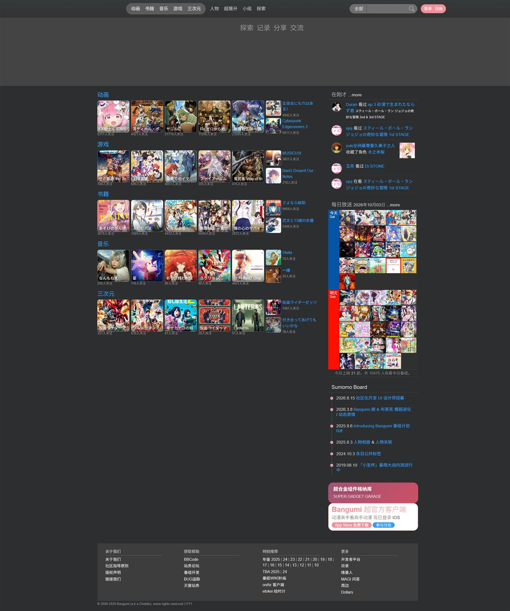
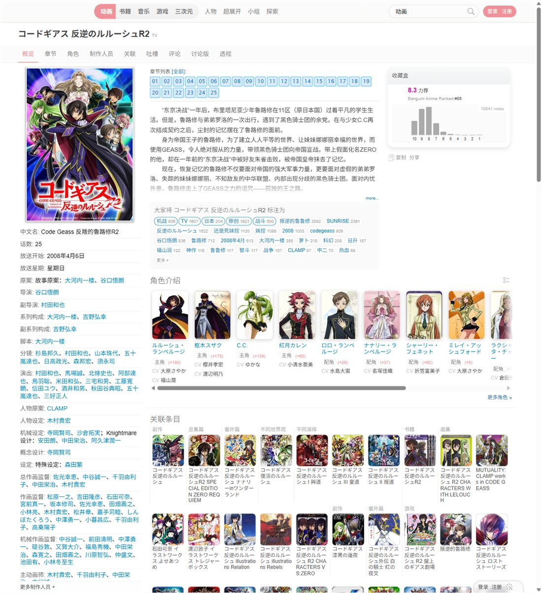
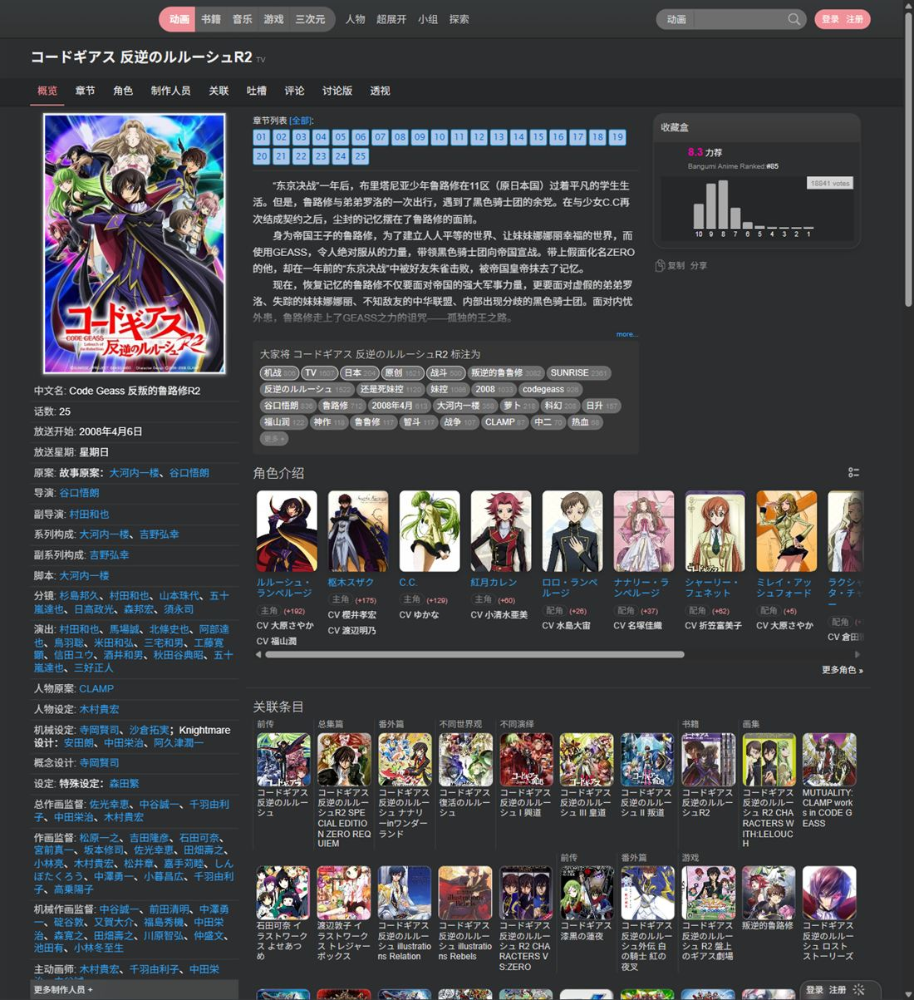

# Bangumi（bgm.tv）UI 风格文档

> **分析对象**：https://bgm.tv/（Bangumi 番组计划）
> **站点版本**：页面版权行与资源查询串均为 `r771`（`/css/dist/bangumi.min.css?r771`、`/min/g=js?r771`）
> **样本页面**：首页 `/`、条目页 `/subject/8`、分类索引 `/anime`、个人主页 `/user/sai`、小组 `/group`、目录 `/index`
> **证据来源**：上述页面的原始 HTML、主样式表（569,913 字节 / 3,983 条规则）、合并脚本（368,813 字节），以及本地离线镜像（363 个静态资源）在 Chrome 中渲染后的截图与计算样式采样。

---

## 1. 一句话概括

Bangumi 是一个**信息密度优先的 ACG 目录型社区站点**：以 12px 小字号、1000/1200px 定宽栅格、细边框 + 柔和浅阴影、胶囊形圆角构成"轻拟物 + 卡片"的混合语汇，用一个可切换的粉色主色（`#f09199`）贯穿所有交互高亮，并提供浅色/深色双主题、6 套主题色与封面/头像密度选项。

---

## 2. 设计定位与气质

| 维度 | 观察结论 | 证据 |
| --- | --- | --- |
| 站点性质 | 目录 + 社区 + 个人收藏管理，单页承载大量结构化信息 | 条目页同时呈现收藏盒、评分直方图、章节网格、标签云、角色横滑、关联条目网格 |
| 视觉气质 | 克制、工具化，接近 2010 年代的日式 Wiki/论坛界面；圆角与粉色提供柔化，未走扁平化极简 | 大量 `inset` 高光阴影、1px 细边框、dotted 分隔线 |
| 密度取向 | 高密度：正文基准 **12px**，列表行高 120%–160%，一屏信息量优先 | CSS 中 `font-size:12px` 出现 146 次，为最高频字号 |
| 品牌色 | 粉 `#f09199` 为默认主色，可整体替换为另外 5 色 | `html{--primary-color:#f09199}` + `html[data-theme-color=...]` |
| 主题能力 | 浅色/深色 + 6 主题色 + 封面尺寸/头像尺寸 2 组密度开关 | `<html data-theme="light" data-theme-color="pink" data-cover-size="default" data-avatar-size="default">` |

浅色主题（首页）：


深色主题（同一页面，仅切换 `data-theme="dark"`）：



---

## 3. 色彩系统

### 3.1 主题与主色令牌

```css
html { --primary-color: #f09199; }

html[data-theme-color=pink]   { --primary-color:#f09199; --filter-black-to-primary: brightness(0) saturate(100%) invert(72%) sepia(4%)  saturate(4588%) hue-rotate(308deg) brightness(97%)  contrast(94%); }
html[data-theme-color=blue]   { --primary-color:#02A3FB; --filter-black-to-primary: … hue-rotate(178deg) …; }
html[data-theme-color=green]  { --primary-color:#89bd88; --filter-black-to-primary: … hue-rotate(70deg)  …; }
html[data-theme-color=purple] { --primary-color:#a987ec; --filter-black-to-primary: … hue-rotate(214deg) …; }
html[data-theme-color=orange] { --primary-color:#f37d4b; --filter-black-to-primary: … hue-rotate(11deg)  …; }
html[data-theme-color=red]    { --primary-color:#e24658; --filter-black-to-primary: … hue-rotate(326deg) …; }
```

- 站点只用**一个主色变量** `--primary-color`，全站高亮统一走它；每个主题色额外提供一条 CSS `filter` 链 `--filter-black-to-primary`，用于把**黑色图标/单色图片实时染成主色**（避免为每个色板准备一套图标资源）。
- 主色的消费点是固定的几类：主导航 hover 态、选项卡选中态（胶囊填充 + 白字）、标签选中态、`small.primary` 文字、`strong.p_cur` 胶囊标签、输入框 focus 边框与发光。

### 3.2 主色出现方式（源码摘录）

```css
.tag-checkbox.selected           { background: var(--primary-color,#f09199); color:#fff; border-color: var(--primary-color,#f09199); }
.horizontalOptions ul li.current a { background-color: var(--primary-color,#f09199); color:#fff; border-radius:50px; text-decoration:none; }
#navNeue2 #navMenuNeue li a.chl:hover { background: var(--primary-color,#f09199); color:#fff; }
#headerSearch:focus-within       { border-color:#f09199; box-shadow:0 0 10px rgba(240,145,153,.6); }
```

### 3.3 中性色阶（CSS 中出现频次，前 15）

`#fff`(407)、`#eee`(192)、`#444`(164)、`#f09199`(152)、`#999`(115)、`#ddd`(93)、`#333`(91)、`#ccc`(88)、`#666`(87)、`#555`(83)、`#369cf8`(66)、`#000`(51)、`#aaa`(50)、`#fafafa`(49)、`#6e6e6e`(44)

实际使用方式：

| 层级 | 取值 | 用途 |
| --- | --- | --- |
| 页面底 | `#fff` / `#fafafa` / `#f5f5f5` | 内容底、区块底、`modifyTool` 工具条底 |
| 分隔线 | `#eee` / `#ddd` / `#e0e0e0` / `#ccc` | 实线/虚线/点线分隔（`dotted #e0e0e0` 用于列表项） |
| 主文本 | `#444` / `#333` | 正文与标题 |
| 次级文本 | `#555` / `#666` / `#888` | 说明、`small.grey` |
| 弱文本 | `#999` / `#aaa` / `#bbb` | 时间、计数、禁用 |

### 3.4 功能色

| 角色 | 取值 | 用途 |
| --- | --- | --- |
| 交互蓝 | `#369cf8` | 全站 hover/active 强调色（导航 hover、按钮 hover、下拉项 hover、Tab hover） |
| 链接蓝 | `#0084b4` / `#0187c5` | 标签描边与文字、链接色 |
| 深色链接 hover | `#02a3fb` | 深色主题下链接 hover |
| 成功绿 | `#4caf50` | `a.btnGreen` |
| 主题红 | `#e24658` | `data-theme-color=red` |
| 错误提示 | `#c00` | `.alarm{color:#c00;font-size:12px}`（表单校验/提交失败文案） |

> 注意一个反直觉点：**默认主色是粉色，但"交互蓝" `#369cf8` 才是最高频的 hover 色**。按钮、下拉项、Tab 的 hover 最终都落到蓝色，只有"选中/当前"状态才使用主色。

### 3.5 深色模式

```css
[data-theme=dark] body            { background-color:#2d2e2f; color:#fff; }
[data-theme=dark]                 { color-scheme: dark; supported-color-schemes: dark; }
html[data-theme=dark] input[type=text], html[data-theme=dark] textarea { background:#303132; color:#e0e0e1; }
[data-theme=dark] a:link, a:visited { color:#eee; }
[data-theme=dark] a:hover          { color:#02a3fb; }
[data-theme=dark] .modal-panel     { background: rgba(40,40,40,.8); color:#fff; }
```

- 深色不是"整体反色"，而是**逐条覆盖**：主样式表中 `[data-theme=dark]` 前缀规则成规模出现，覆盖背景、文字、边框、hover 与组件（按钮、下拉、列表分隔线从 `#ddd` 变为 `#444`/`#6e6e6e`）。
- 深色下背景统一收敛到三个层次：底 `#2d2e2f`、卡片/面板 `#303132`/`#323232`、分割 `#444`。
- 深色下的按钮 hover 目标色与浅色不同（如 `btnBlue:hover` 变 `#f09199`），说明配色经过人工调校而非机械映射。

---

## 4. 字体与排版

**字体栈（body 实测计算值）**

```
"SF Pro SC","SF Pro Display","PingFang SC","Lucida Grande","Helvetica Neue",
Helvetica,Arial,Verdana,sans-serif,"Hiragino Sans GB"
```

另有独立声明用于特定区域：`"Lucida Grande","Lucida Sans",Helvetica,Arial,Verdana,sans-serif`（英文界面）、`'SF Pro SC',…,sans-serif,"Hiragino Sans GB"`（新版容器）。

**字号阶梯（按 CSS 中出现次数排序）**

| 字号 | 次数 | 典型用途 |
| --- | --- | --- |
| 12px | 146 | 正文基准、列表、按钮小号、标签 |
| 14px | 71 | 区块标题、Tab、列表项标题、输入 |
| 13px | 64 | 卡片标题、次级标题 |
| 10px / 11px | 47 / 34 | 角标、计数、极小注释 |
| 15px / 16px | 25 / 14 | 面板标题、正文放大 |
| 18px / 20px | 9 / 6 | 页面标题、评分数字 |
| 24px / 25px / 30px | 3 / 3 / 2 | 首页营销区、品牌字 |

- **行高**：基准 `18px`（≈150%），组件内常用 `120%`（紧凑列表）与 `160%`（正文段落）。
- **字重**：`400`(81) 为主，`700`(39) 用于标题与强调，`300`(6) 仅用于营销区（App 推广卡）。
- **等宽**：`"Courier New",Courier,monospace`、`SFMono-Regular,Consolas,"Liberation Mono",Menlo,monospace`、`Menlo,Monaco,Consolas,monospace` —— 用于代码、BBCode 示例、进度数字。

排版特征：**同一屏内字号跨 10px–20px 共 6 级**，靠字号 + 颜色深浅（而非留白）建立层级。

---

## 5. 布局与栅格

### 5.1 全局骨架

```
html[data-theme][data-theme-color][data-cover-size][data-avatar-size]
└─ #wrapperNeue.wrapperNeue(.mainXL)
   ├─ #headerNeue2               顶部导航（约 53px 高）
   │  └─ .headerNeueInner        内含 .bg.musume_*（看板娘雪碧图）、.logo、#navNeue2、#headerSearchWrapper、.idBadgerNeue
   ├─ #main.mainWrapper          内容容器
   │  ├─ #introWrapper / .slider 首页营销滑块
   │  └─ .columns.clearit        flex 列容器
   │     ├─ .column-main / #columnSubjectHomeA 等
   │     └─ .column-side / #columnSubjectHomeB 等
   ├─ #footer                    多列页脚
   ├─ #dock                      右下角浮动工具条
   └─ #robot                     看板娘浮层（固定右下）
```

### 5.2 容器与列宽（实测 + 源码）

| 项 | 默认 | 宽屏（`.mainXL` 生效） |
| --- | --- | --- |
| 内容容器 | `.mainWrapper{width:1000px;margin:0 auto}` | `#main,.mainWrapper{width:100%;max-width:1200px;padding:0 10px}` |
| 列容器 | `.columns{width:1000px}`（浮动布局） | `.columns{display:flex}`，`.column-main{flex:7}` / `.column-side{flex:3}`，`.column-col-1…5` 五档 |
| 实测（1280px 视口） | — | 容器 1200px（内容区 1180px）；条目页左栏 292px + 主栏 875px，栏间距 10px |

- 首页/条目页的列比例：**主内容 : 侧栏 ≈ 7 : 3**（条目页左栏为 `infobox` 元信息栏，主栏为正文）。
- 区块间距统一采用 **10px / 15px / 20px** 三档（`--base-margin`、`--info-margin` 变量亦为 20/10 与 10/5 两组）。

### 5.3 响应式断点

| 断点 | 次数 | 作用 |
| --- | --- | --- |
| `max-width:640px` | 50（+ 2 处 `screen and`） | **主断点**：切移动布局、启用汉堡菜单与折叠搜索、按场景隐藏侧栏 |
| `max-width:480px` | 3 | 更窄手机的进一步收缩 |
| `max-width:1000px` | 2 | 收窄定宽容器 |
| `max-width:768px` | 1 | 局部组件 |
| `max-width:340px` | 1 | 极窄屏兜底 |
| `-webkit-min-device-pixel-ratio:2` | 1 | 2x 图（`bg_musume_2x.png`） |

移动端的导航折叠**不使用 JavaScript**，而是 `input.menu-toggle[type=checkbox]` + `label.menuCompact` 的纯 CSS 方案（含互斥逻辑：点击菜单会自动取消搜索面板的勾选，反之亦然，由内联 `onclick` 完成）。

---

## 6. 形状、边框与阴影

**圆角分布（源码统计）**

| 取值 | 次数 | 归属 |
| --- | --- | --- |
| `5px` | 310 | 默认小圆角：按钮小号、输入框、工具条、面板 |
| `15px` | 111 | 中大容器、搜索框 |
| `10px` | 76 | 卡片（`.subject-card`）、面板 |
| `8px` | 65 | 中等控件 |
| `20px` | 37 | 标签胶囊 |
| `100px` / `50px` / `50%` | 36 / 21 / 18 | 主导航胶囊、按钮胶囊、圆形头像 |
| `0` | 30 | 表格、分隔区块（刻意保持直角） |

**阴影（源码统计，节选）**

| 阴影 | 次数 | 用途 |
| --- | --- | --- |
| `0 0 5px #ddd` | 19 | 卡片/浮层柔光（浅灰无方向光） |
| `inset #0187c5 0 0 4px 0` | 18 | 输入类控件的**内发光**（聚焦感） |
| `inset #bbb 0 0 2px 0` | 18 | 内凹边框效果 |
| `0 1px 2px #eee, inset 0 1px 1px #fff` | 15 | **上高光 + 下投影**的拟物组合 |
| `0 0 0 2px rgba(0,0,0,.04)` | 12 | 发丝描边（不占布局） |
| `0 5px 30px 10px rgba(0,0,0,.2)` | — | `.modal-panel` 弹窗外发光 |

**关键结论**：Bangumi 的立体感来自 `inset` 内阴影与 1px 高光边，而不是现代的大圆角 + 大扩散阴影；新增组件若直接套用现代阴影语言，会与既有界面割裂。

**过渡节奏（源码统计）**

`all linear .1s`(124) → `all .3s ease-in-out`(38) → `all .2s ease-in-out`(32) → `visibility 0s,opacity .15s linear`(12)

- 高频交互（hover 变色）用 **100ms linear**，几乎瞬时；容器型变化用 **200–300ms**。
- 主题切换有专门的一条：`html[data-theme-change='1'] * { transition: background-color .3s linear, border-color .3s linear }`，切换完成后由 JS 移除该属性，避免常驻过渡开销。

---

## 7. 组件规范

### 7.1 按钮

```css
a.btnRedSmall { background:#f09199; color:#fff; padding:2px 10px; font-size:12px; border-radius:50px; }
a.btnGraySmall{ background:#eee;    color:#888; }
a.btnBlueSmall{ background:#369cf8; }
a.btnGreenSmall{ background:#4caf50; }
/* 深色 */
html[data-theme=dark] a.btnGray, html[data-theme=dark] a.btnGraySmall { background:#6e6e6e; color:#fdfdfd; }
html[data-theme=dark] a.btnGreen:hover, a.btnPink:hover, a.btnRed:hover { color:#fff; background:#369cf8; }
```

变体矩阵：`btnBlue / btnGreen / btnGray / btnPink / btnRed` × `（常规 / Small）`，共 12 个类名，底色只是覆盖上面这条统一声明：

```css
a.btnPink      { padding:5px 25px; font-size:14px; line-height:150%; border-radius:50px; background:#f09199; }
a.btnGraySmall { padding:2px 10px; font-size:12px; background:#eee; color:#888; }
```

形态统一为**胶囊（50px 圆角）**：常规尺寸是 14px 白字 + 5px 25px 内边距（高约 31px，如收藏弹窗的「保存」），Small 尺寸是 12px + 2px 10px（如弹窗行内的「编辑」）；hover 统一切到 `#369cf8`。次要动作不用白底描边，而是 **`#eee` 底 + `#888` 字**的灰胶囊。

### 7.2 标签（Tag）

```css
.subject_tag_section a { border-radius:20px; border:1px solid #0084b4; color:#0084b4;
                         background:#fefefe; padding:1px 5px; font-size:12px; margin:0 2px 2px 0; }
.tag-checkbox.selected { background:var(--primary-color,#f09199); color:#fff; border-color:var(--primary-color,#f09199); }
```

- 标签是**胶囊描边 + 蓝字**，文本形如「机战 806」（标签名 + 收藏人数），把热度直接编码进标签本体。
- 选中态反转为**主色实心**。

### 7.3 卡片

```css
.subject-card            { background-color:#323232; border:1px solid #444; border-radius:10px; }
.subject-card .inner     { margin-left:65px; padding:5px; line-height:160%; }
.subject-card .inner .title { font-size:13px; font-weight:400; line-height:120%; color:#555; }
```

卡片 = **1px 边框 + 10px 圆角 + 左侧固定宽度封面（65px）+ 右侧文字区**；没有投影，靠边框分组。

### 7.4 列表

```css
ul.collect li.cat  { padding:8px 0 5px; border-bottom:1px solid #ddd; color:#555; }
ul.collect li.item { margin-left:5px; padding:6px 5px; font-size:14px; line-height:120%;
                     border-bottom:1px dotted #e0e0e0; color:#555; }
ul.collect_dropmenu li a:hover { background:#369cf8; color:#fff; }
```

- 层级用**线段样式**表达：实线（分类）→ 点线（条目）。
- 下拉/浮层内的 hover 是**整行填充蓝色 + 白字**。

### 7.5 表单

```css
#headerSearch, .searchBar { border:1px solid #f19299; background:rgba(255,255,255,.8); }
#headerSearch:focus-within, .searchBar:focus-within { border-color:#f09199; box-shadow:0 0 10px rgba(240,145,153,.6); }
#headerSearch input.textfield { width:100%; padding:0 5px; line-height:20px; border:none; background:0 0;
                                box-shadow:none; transition:all .3s ease-in-out; appearance:none; }
#headerSearch input.textfield:focus { outline:0; }
```

- **输入框本体无边框**，边框与配色全部由外层容器承担；聚焦反馈是**容器边框变色 + 主色外发光**，而不是 `outline`。
- 深色下输入框底为 `#303132`。

弹窗与表单里的通用文本控件走另一套基类（`input.inputtext` / `textarea`）：

```css
input.inputtext { padding:5px; font-size:15px; line-height:22px; border:1px solid #d9d9d9;
                  border-radius:5px; background:#fff; color:#000; }   /* 实测高 34px */
input.inputtext:focus { border:1px solid #d98d88 #f4a8bc #f4a8bc #d98d88;
                        box-shadow:inset 0 1px 3px rgba(0,0,0,.1), 0 0 8px rgba(240,145,153,.6); }
```

- 输入框是**独立描边**的 5px 圆角白底控件（不再是"容器承担边框"那套），聚焦时边框转粉、叠一层 `inset` 内阴影与主色外发光。
- `textarea` 同色同圆角，可拖拽缩放。

### 7.6 二级导航（Tab）

```css
.subjectNav   { background:#fbfbfb; height:40px; }
.navTabs li a { font-size:14px; padding:10px 10px 9px; }
.navTabs > li:hover > a  { color:#369cf8; border-bottom:2px solid #369cf8; }
```

- Tab 是**文字 + 2px 下划线**，hover 取蓝，选中取主色（条目页实测：选中项文字为 `rgb(240,145,153)`）。
- 同一 Tab 组在不同页面有两种形态：细下划线式（`.navTabs`）与胶囊式（`.horizontalOptions ul li.current a`）。

### 7.7 弹窗与浮层

```css
/* 新式面板（设置、职员表、组件化弹窗） */
.modal-panel         { background:rgba(254,254,254,.8); backdrop-filter:blur(10px);
                       border:1px solid rgba(255,255,255,.3); border-radius:15px;
                       box-shadow:0 5px 30px 10px rgba(80,80,80,.5); max-width:480px; }
.modal-panel .header { height:40px; color:var(--primary-color,#f09199); border-bottom:1px solid #eee; }
.modal-panel .header h4 { margin-left:10px; font-size:16px; }
.modal-panel .content { padding:0 5px 10px; font-size:14px; }
.modal-panel .widget-item { display:flex; align-items:center; padding:10px 0; border-bottom:1px solid #eee; }

/* 表单弹窗（收藏修改等，走 thickbox） */
#TB_window           { background:rgba(254,254,254,.8); backdrop-filter:blur(20px);
                       border:1px solid rgba(255,255,255,.3); border-radius:15px;
                       box-shadow:0 5px 30px 10px rgba(80,80,80,.5); }
#TB_title            { display:flex; justify-content:space-between; align-items:center; height:40px;
                       color:var(--primary-color,#f09199); border-bottom:1px solid #eee; }
#TB_ajaxWindowTitle  { padding:10px 15px; font-size:16px; font-weight:700; }
#TB_closeWindowButton{ width:30px; height:30px; background:15px 细线 × 居中 / 50% auto no-repeat; }
#TB_ajaxContent.TB_modal { padding:15px; }
div.collectBox       { padding:10px 15px; }
div.collectBox div.collectType { padding:5px 0 10px; font-size:14px; color:#666; border-bottom:1px solid #eee; }
```

- **浅色主题下弹窗是浅色玻璃**：`rgba(254,254,254,.8)` + 10–20px 背景模糊 + 1px 白色半透明描边，靠 `0 5px 30px 10px rgba(80,80,80,.5)` 的**大扩散柔光**与页面分离（遮罩本身只有 `rgba(0,0,0,.1)`）。深色主题才切成 `rgba(40,40,40,.8)`。
- 标题栏恒为 **40px**：左对齐的 **16px/700 主色**标题 + 右侧 30×30 点击区里的 **15px 细线 ×**（`#ccc`，无边框无底色），下方压一条 1px `#eee` 实线。
- 内容区 **15px 内边距**；字段名是控件**上方**的 12px 灰字；收藏类型那一行（`.collectType`）横排**原生 radio**，并用 1px `#eee` 实线收尾。
- 底部操作区没有分隔线，只有留白：主按钮是粉色胶囊（`a.btnPink`），次要动作是 `#eee` 底、`#888` 字的灰色胶囊（`a.btnGraySmall`）。
- 图片查看仍使用 thickbox 灯箱（`#TB_*` 系列 DOM）。

### 7.8 评分与统计（条目页"收藏盒"）

条目页右上的收藏盒包含：大号均分 + 评价词（如「力荐」）+ 站内排名 + **10→1 的评分直方图** + 投票总数。



- 数字（分数）用大字号承担视觉重心，直方图用极简细柱，避免图表库式的装饰。
- 章节列表是**正方形数字网格**（`01 02 03 …`），未看/已看用底色区分，鼠标悬停就地出操作。

条目页深色：



### 7.9 图标与图像

- 图标走**雪碧图 + 语义类名**：`.ico_subject_type`（26 处，条目类型）、`.ico_like/_fill/_more/_del/_filter/_grid/_list/_customize/_notify/_pm/_reply/_mark/_home/_person/_character/_robot_open/_robot_close` 等。
- 单色图标可通过 `--filter-black-to-primary` 实时染色。
- 顶部 `.bg.musume_1 … .musume_6` 是**看板娘雪碧图分帧**（`bg_musume_2x.png`，2x 版本存在）。
- 图片普遍使用 `loading="lazy"`，封面按 `100x100 / 400` 两档取图。

### 7.10 浮动工具条与看板娘

```html
<div id="dock">
  <ul>
    <li class="first"><a href="…/login">登录</a><a href="…/signup">注册</a></li>
    <li><a class="toggle-customize" title="个性化"><span class="ico ico-sq ico_customize">个性化</span></a></li>
    <li class="last"><a id="showrobot" class="toggle-robot">&nbsp;</a></li>
  </ul>
</div>

<div id="robot" style="display:none;">
  <div id="ukagaka_shell" data-shell="1" data-balloon="2">
    <div id="robot_balloon" class="ukagaka_balloon_pink">
      <div id="robot_speech" class="speech">没<a href="…/signup" class="nav">注册</a>时我很沉默</div>
      <div id="robot_speech_js" class="speech" style="display:none;"></div>
    </div>
    <div class="ukagaka_body shell_1"><div id="ukagaka_voice"></div></div>
  </div>
</div>
```

- `#dock{position:fixed;bottom:0;right:50px}`、`#robot{position:fixed;bottom:0;right:50px;z-index:90}`。
- 看板娘气泡有皮肤变体（`ukagaka_balloon_pink`）、外壳/气泡编号（`data-shell`/`data-balloon`）与语音按钮（`#ukagaka_voice`）。

---

## 8. 主题、个性化与密度

| 能力 | 实现 | 证据 |
| --- | --- | --- |
| 浅色/深色 | `html[data-theme]`，切换时临时加 `data-theme-change='1'` 让颜色 0.3s 过渡后移除 | `setTheme()` 中 `attr('data-theme-change','1')` → `setTimeout(…300)` 移除 |
| 主题色 | `html[data-theme-color]` + `--primary-color`（6 色） | 见 3.1 |
| 封面密度 | `html[data-cover-size]` | 页面根属性 |
| 头像密度 | `html[data-avatar-size]` | 页面根属性 |
| 跟随系统 | `color-scheme: dark; supported-color-schemes: dark` + JS `autoTheme/applyThemeMode/isDark` | CSS + `chiiLib.ukagaka.*` |
| 自定义外观 | 个性化面板：`switchDesignTab / updateColors / setBackgroundImage`，`#toggleTheme` 文案在「开灯 / 关灯」间切换 | `chiiLib.style_design.*` |
| 持久化 | Cookie（`chii_theme`、`chii_theme_choose` 30 天）+ 云端设置 | `chiiLib.cloud_settings.save/get/getAll` |

**设计要点**：个性化不是"设置页里的开关"，而是右下角 Dock 里随时可点的**「个性化 / 开灯 / 关灯」**入口，加上一整套"云同步"存储，使换肤成为轻量、即时的日常动作。

---

## 9. 页面模板速览

| 模板 | 结构要点 | 视觉特征 |
| --- | --- | --- |
| 首页（未登录） | 营销滑块 + 5 大分类"5 大图 + 3 小图"网格 + 右栏（动态、每日放送、Sumomo Board 公告、App 推广） | 每类首行 5 张封面 + 右侧 3 条小条目；右栏顶部"在刚才 …more"时间线 |
| 条目页 | 头部（标题 + 类型图标）→ 二级 Tab → 左 `infobox` / 中正文（简介、标签云、角色横滑）/ 右 收藏盒 | 左栏 292px 固定元信息；中栏标签密集；右下角固定 Dock |
| 分类索引 `/anime` | 筛选器 + 条目网格/列表切换（`.ico_grid` / `.ico_list`） | 同一数据两种密度视图 |
| 个人主页 | 收藏分类列表、时光机、好友、小组 | 列表密集，分隔线细点线 |
| 小组 / 目录 | 论坛式帖列表 | 表格式排版、弱装饰 |

---

## 10. 无障碍与可用性观察

**已有做法**：`aria-label`（菜单/搜索按钮）、`role="button"`、`label[for]` 关联 checkbox、装饰图使用背景图、内容图带 `alt`、图片 `loading="lazy"`、`color-scheme` 声明。

**风险点（还原时应规避或改进）**：

- 正文基准 12px、辅助信息 10–11px，长时间阅读与低视力用户不友好；
- 大量信息只在 `hover` 时呈现（tooltip、就地操作），触屏与键盘用户难以触达；
- 输入框 `outline:0` 后仅靠容器发光表达焦点，焦点可见性偏弱；
- 中灰文字（`#999` 于 `#fff` 上）对比度约 2.8:1，低于 WCAG AA。

---

## 11. 与 `bgm-assistant-v2` 现有前端的对照

现状（`web/src/styles/`）：本项目 Web 终端目前使用移植自 deepseek-harness 的设计 token（`--dsw-*` / `--dsh-*`，Montserrat + 正文 14px、圆角 4/8/12/16/20/28px、`--dsw-elevation-*` 发丝描边体系、`body[data-ds-dark-theme]` 深色）。

若要在本项目内**呈现 Bangumi 风格的内容区**，可直接对齐的项与需要决策的项如下：

| 维度 | Bangumi | 本项目现状 | 建议 |
| --- | --- | --- | --- |
| 主色 | `#f09199` + 5 色可变 | `--dsw-alias-brand-primary`（中性） | 新增 `--dsh-bgm-primary`，默认 `#f09199`，与 DSH 品牌色并存 |
| 交互强调色 | `#369cf8` | `--dsw-alias-state-business-primary` `rgb(65,118,230)` | 保留 DSH 蓝，或引入 `#369cf8`，避免两者同屏冲突 |
| 正文尺寸 | 12px/18px | 14px/22px（`--dsh-content-font-size`） | 内容区可降到 13–14px，不建议直接 12px |
| 圆角 | 5 / 10 / 20 / 50px | 4 / 8 / 12 / 16 / 20 / 28px | 卡片用 10px、胶囊用 999px，其余沿用 DSH 刻度 |
| 分层方式 | 1px 边框 + `0 0 5px` 柔光 + inset 高光 | `--dsw-elevation-*` 发丝描边 + 极淡柔光 | 二者接近，可直接复用 DSH elevation，不必移植 inset 拟物阴影 |
| 深色底 | `#2d2e2f` | `--dsw-static-neutral-bluish-950` `rgb(21,21,23)` | 统一用 DSH 深色底，避免同屏双深色系 |
| 主题切换 | `data-theme` + 300ms 颜色过渡 | `body[data-ds-dark-theme]` + `data-input-modality` | 复用 DSH 切换机制，不引入第二套属性 |
| 焦点反馈 | 容器变色 + 主色发光 | `:focus-visible` 焦点环（`--dsw-focus-ring-width`） | **保留 DSH 焦点环**，不要用 `outline:0` |

一句话：**取 Bangumi 的"内容密度、卡片分组、标签胶囊、评分直方图"，不要取它的 12px 基准字与 hover-only 交互**。

---

## 12. 证据与统计口径（附录）

| 项 | 值 |
| --- | --- |
| 主样式表 | `/css/dist/bangumi.min.css?r771`，569,913 字节，单行压缩，3,983 条规则 |
| 合并脚本 | `/min/g=js?r771`，368,813 字节（含 jQuery 及站点 `chiiLib.*` 模块） |
| 抓取页面 | `/`、`/subject/8`、`/anime`、`/user/sai`、`/group`、`/index` |
| 离线镜像 | 363 个静态资源本地化后在 Chrome 中渲染（页面脚本被剥离，仅用于视觉采样） |
| 统计口径 | 颜色/圆角/阴影/字号/字重次数均为对压缩 CSS 的全文正则计数；布局数值为 1280px 视口下的 `getComputedStyle` 实测 |
| 未能验证 | 登录态下的首屏（首页登录面板由 AJAX `/login/panel` 注入，离线镜像中为空）；后端轮询间隔；Live2D 模型资源 |

**版本提示**：本文所有数值基于 `r771`。Bangumi 的样式表是单文件压缩产物，改版时数值可能变动，落地实现前建议重新核验主色、圆角与容器宽度三项。
